[](https://t.me/tuxpulse)


[](https://www.paypal.com/donate/?hosted_button_id=PTH2EXUDS423S)
[](http://revolut.me/adriannm9?style=plastic)


[](LICENSE.md)


# TuxPulse

TuxPulse is a Python + PyQt desktop maintenance toolkit for Linux.

The project currently includes:
- a GUI application launched from `app/main.py`
- a unified package builder for **DEB** and **RPM** via `build_packages.sh`
- a legacy DEB-only builder via `build_deb.sh`
- packaging assets for **Arch Linux** in `packaging/arch/PKGBUILD`
- helper, systemd and polkit assets in the repository for the secure execution model

## Main features

TuxPulse currently exposes the following main areas in the application:

- **Dashboard** – live system monitoring and summary widgets
- **Maintenance** – update / maintenance actions, including full maintenance flows
- **Disk** – graphical disk analysis
- **Kernel** – kernel report and suggested cleanup actions
- **Cleaner** – cache, logs and cleanup tasks
- **Startup** – startup application inspection / control
- **Services** – system service inspection / control
- **Packages** – installed package listing, upgrades and removal helpers
- **Installer** – application catalog with native package manager / Flatpak support
- **UI extras** – dark mode / light mode, bilingual direction (English / Romanian), release-awareness logic for GitHub updates

## Gallery

<p align="center">
  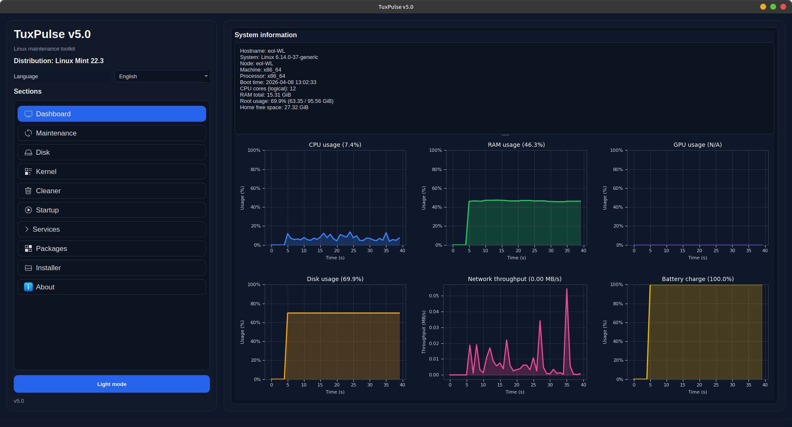
  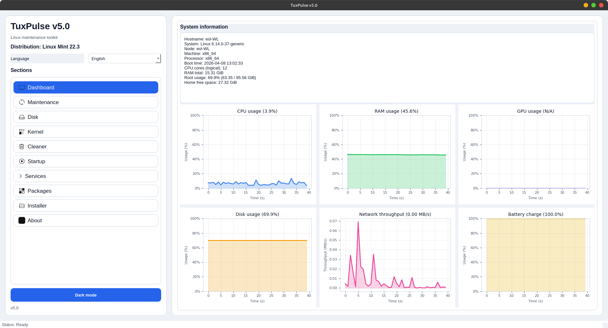
</p>

<p align="center">
  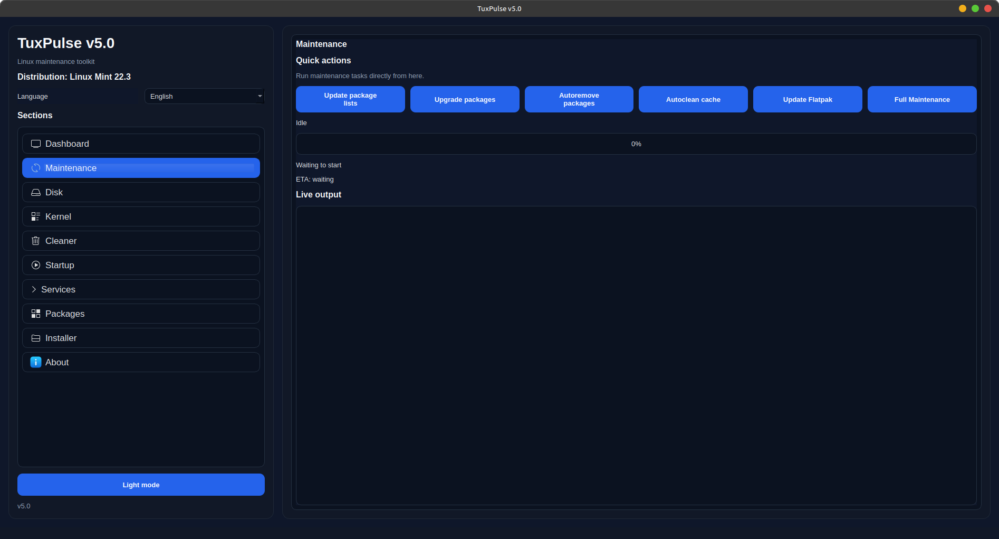
  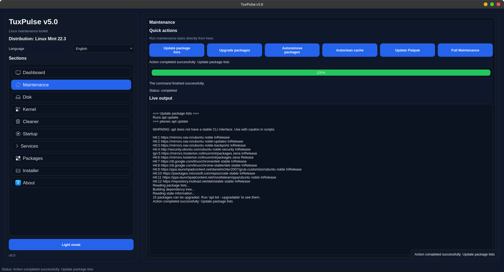
</p>

<p align="center">
  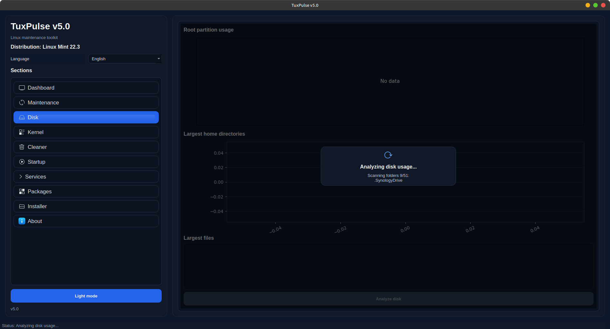
  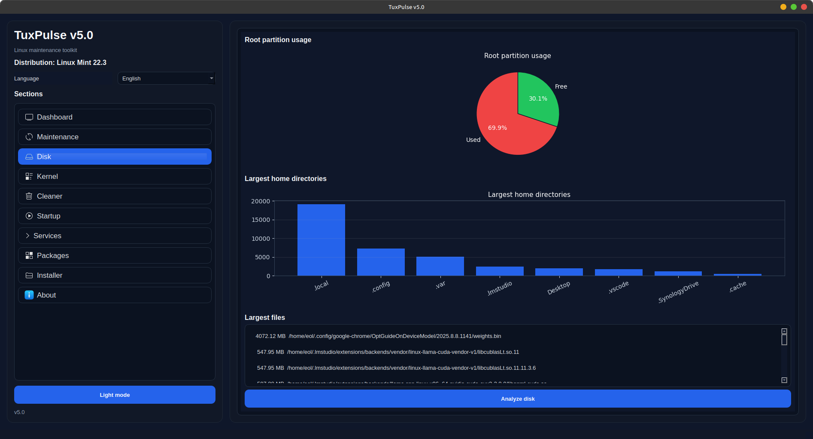
</p>

<p align="center">
  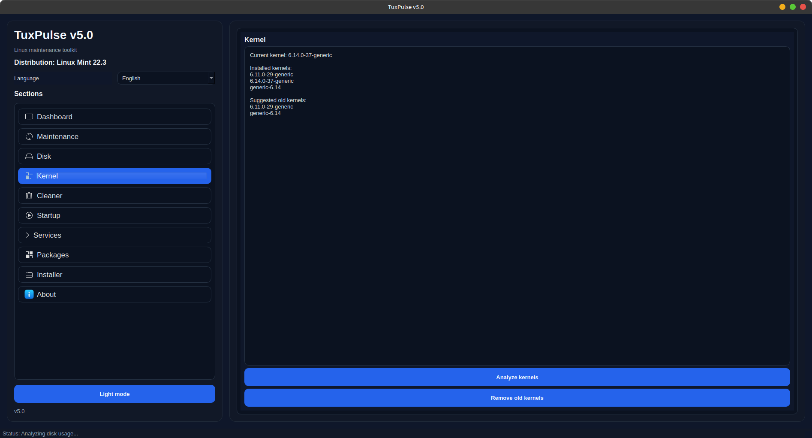
  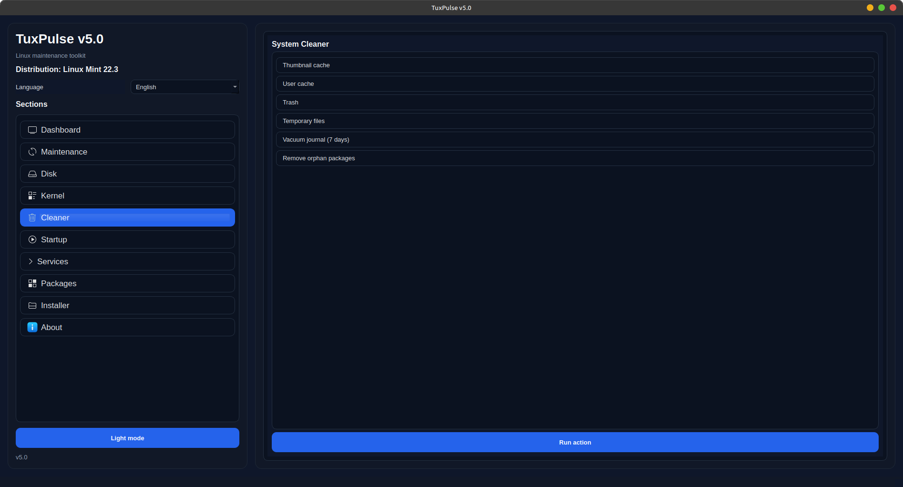
</p>

<p align="center">
  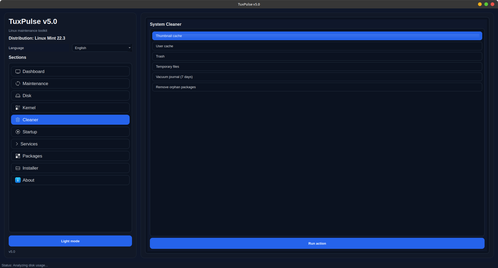
</p>

<p align="center">
  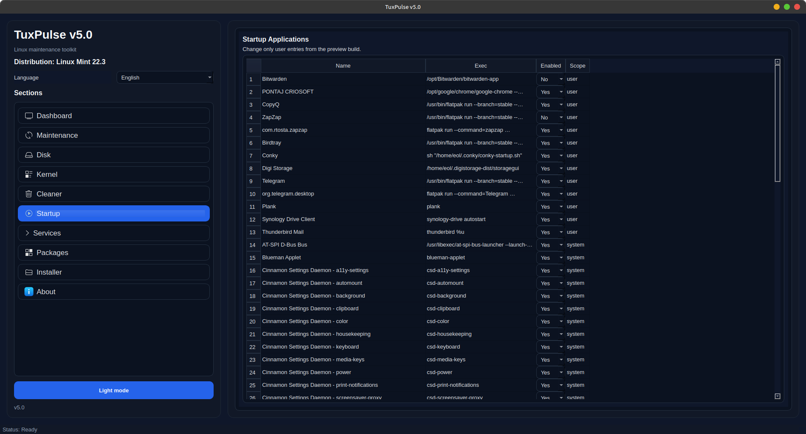
  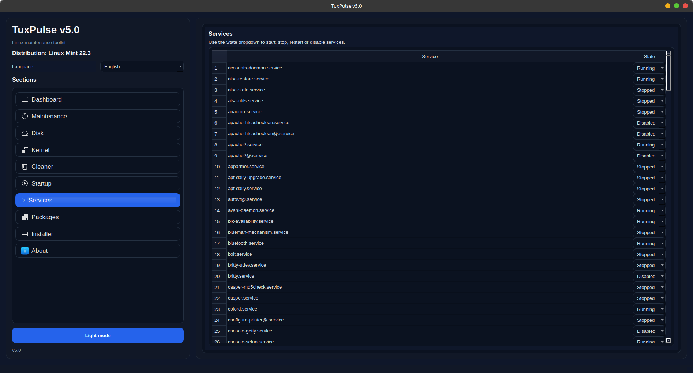
</p>

<p align="center">
  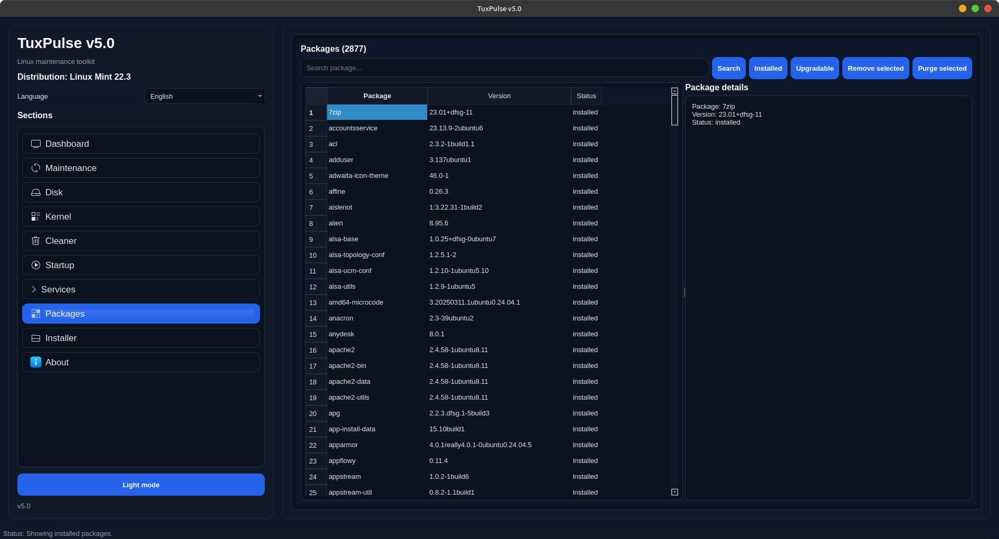
  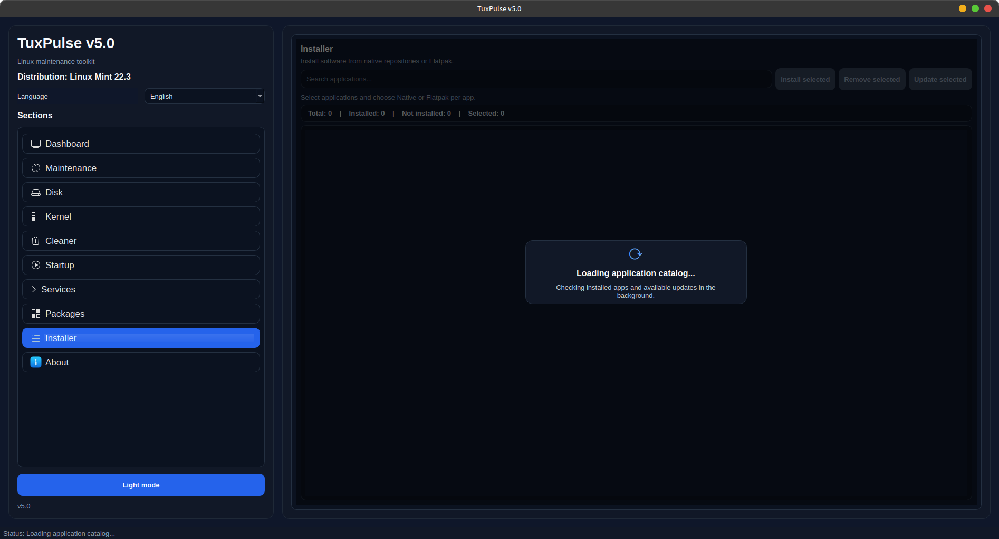
</p>

<p align="center">
  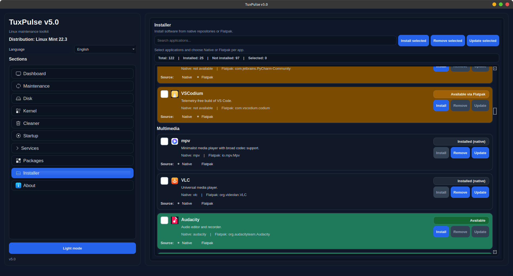
  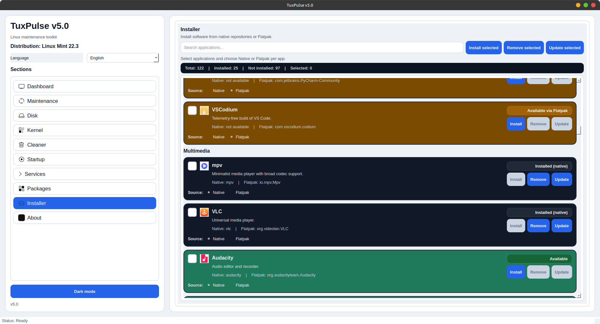
</p>

<p align="center">
  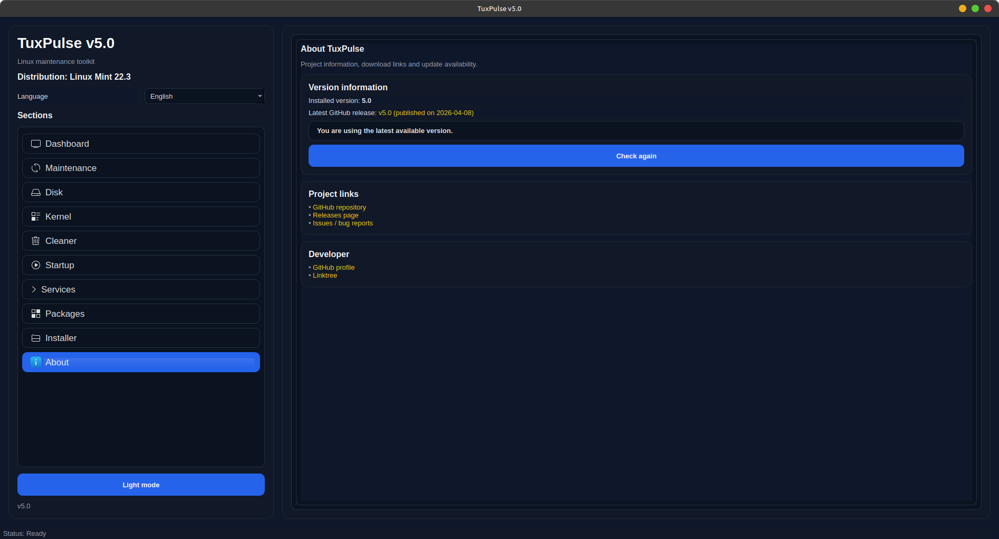
</p>

## Distribution support

### Current packaging state

- **DEB**: supported by `build_packages.sh`
- **RPM**: supported by `build_packages.sh` when `rpmbuild` is installed
- **Arch Linux**: repository scaffold exists through `packaging/arch/PKGBUILD`, but it is not yet built by the unified builder

## Requirements

### Debian / Ubuntu

```bash
sudo apt update
sudo apt install python3 python3-pyqt5 python3-psutil python3-matplotlib flatpak
```

### Fedora

```bash
sudo dnf install python3 python3-qt5 python3-psutil python3-matplotlib python3-matplotlib-qt5 flatpak
```

For RPM package creation:

```bash
sudo dnf install rpm-build desktop-file-utils gtk3
```

### Arch Linux

```bash
sudo pacman -S python python-pyqt5 python-psutil python-matplotlib polkit flatpak
```

## Run from source

### Debian / Ubuntu / Fedora

```bash
python3 app/main.py
```

### Arch Linux

```bash
python app/main.py
```

## Build packages

### Recommended: unified DEB + RPM builder

The recommended release builder is:

```bash
chmod +x build_packages.sh
./build_packages.sh
```

What it does:
- reads the application version from `app/version.py`
- builds a versioned **DEB** package into `dist/`
- attempts to build a versioned **RPM** package into `dist/` when `rpmbuild` is available
- packages the application sources, helper directory, launcher, desktop entry and optional icon

Expected output:

```text
dist/
├── tuxpulse_<version>_all.deb
└── tuxpulse-<version>-1.<dist>.noarch.rpm
```

### Legacy: DEB-only builder

The repository still contains:

```bash
chmod +x build_deb.sh
./build_deb.sh
```

This script is useful as a simple DEB packager, but for release builds the unified builder is preferred because it reads the version from `app/version.py` and produces versioned artifacts in `dist/`.

## Install the generated packages

### Install DEB

```bash
sudo apt install ./dist/tuxpulse_<version>_all.deb
```

### Install RPM

```bash
sudo dnf install ./dist/tuxpulse-<version>-1*.noarch.rpm
```

## Arch Linux packaging note

The repository already contains `packaging/arch/PKGBUILD`, which is the right starting point for Arch support.
### 1. Clone the project from GitHub
### 2. Make the script executable
### 3. Build + automatic installation

```bash
git clone https://github.com/eoliann/TuxPulse.git
cd TuxPulse
chmod +x build_arch.sh
./build_arch.sh --install
```

Before publishing Arch packages, verify and update the PKGBUILD metadata (especially `pkgver`, dependencies and installed assets) so it matches the current application version and packaging layout.

## Secure execution model

The repository contains:
- `helper/`
- `packaging/systemd/tuxpulse-helper.service`
- `packaging/polkit/com.tuxpulse.policy`

This shows the project direction toward a helper-based privileged execution model.

At the moment, the unified package builder focuses on packaging the app itself, helper sources, desktop entry and icon. If you want DEB/RPM packages that also install and enable the helper service / polkit policy automatically, extend `build_packages.sh` accordingly.

## Custom icon

Place your PNG icon here before building:

```bash
assets/tuxpulse.png
```

The package builders will include it when the file exists.

## Project layout

```text
TuxPulse/
├── app/
├── assets/
├── helper/
├── packaging/
│   ├── arch/
│   ├── deb/
│   ├── polkit/
│   └── systemd/
├── build_deb.sh
├── build_packages.sh
└── README.md
```

## Versioning

The application version is stored in:

```bash
app/version.py
```

For release consistency, update the version there before building packages.

## Notes

- `build_packages.sh` is the main packaging entry point for current DEB/RPM release work.
- `build_deb.sh` remains in the repository, but it is better treated as a legacy / fallback script.
- Arch support is already scaffolded in the repository, but should be aligned with the current version and packaging flow before publishing.
- The README should be kept in sync whenever the package layout, dependencies or helper installation flow changes.
